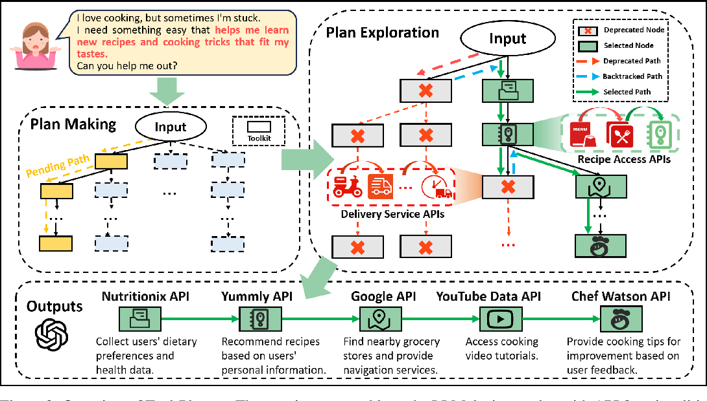
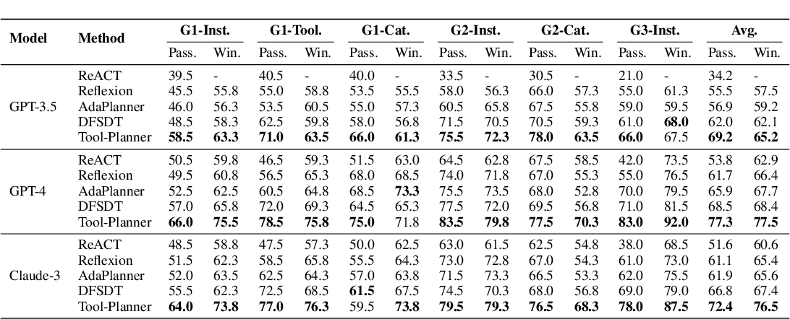
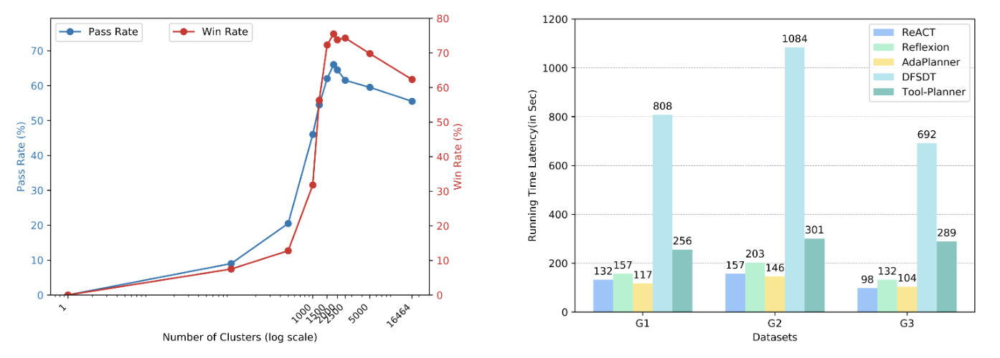

# Tool-Planner: Dynamic Solution Tree Planning for Large Language Model with Tool Clustering

<p align="center">
</a>


<a href="https://github.com/OceannTwT/Tool-Planner/stargazers"></a>
</p>


This is the official repository of the paper: [Tool-Planner: Dynamic Solution Tree Planning for Large Language Model with Tool Clustering](https://arxiv.org/abs/2406.03807)



## 🎯Installation Enviorment

Update your environment for the required dependency. 

```shell
conda create --name raisf python=3.11 -y
conda activate tool-planner
pip install -r requirement.txt
```

## Collect ToolBench Util

Use the following link to download the `Toolbench` dataset. It will be used to extract the tool calling methods and descriptions from `RapidAPI`, and to complete the subsequent setup of the Toolkit.

[Google Drive](https://drive.google.com/drive/folders/1yBUQ732mPu-KclJnuQELEhtKakdXFc3J) or [Tsinghua Cloud](https://cloud.tsinghua.edu.cn/f/c9e50625743b40bfbe10/)

* Putting the file to the main directory.

```shell
mv your_path/datas Tool-Planner
```

* Make sure you have the access of `ToolBench` API. refer to [Toolbench](https://github.com/OpenBMB/ToolBench) to apply for the permission.

## Download SimCSE

Downloading SimCSE model to your local directory.

```shell
mv your_path/sup-simcse-roberta-base Tool-Planner/model
```

Or Upload it from `HuggingFace`.

```python
tokenizer = AutoTokenizer.from_pretrained("princeton-nlp/sup-simcse-roberta-base")
model = AutoModel.from_pretrained("princeton-nlp/sup-simcse-roberta-base")
```

## Inference Tool-Planner

Use your `ChatGPT` API and `Toolbench` API, replace the API key in run.sh, and run the following script.

```shell
bash script/run.sh
```


To obtain the corresponding result information for your query, change the number of toolkits and adjust the file location of the input query.

```shell
export TOOLBENCH_KEY=""
export OPENAI_KEY=""
export PYTHONPATH=./

python main.py \
    --toolkit_dir src/toolkits \
    --tool_api_dir datas/toolenv/tools/ \
    --backbone_model gpt_3.5 \
    --toolkit_num 20 \
    --openai_key $OPENAI_KEY \
    --tool_env datas/toolenv/tools/ \
    --tool_output_file tool_lib/tool_library.json \
    --toolkit_output_file tool_lib/toolkit_library.json \
    --input_query_file data/instruction/G3_query.json \
    --output_answer_file data/instruction/tool_result.json \
    --simcse_file model_lib/sup-simcse-roberta-base \
    --toolbench_key $TOOLBENCH_KEY
```

## Main Results




## Evaluations



- Experiments have demonstrated that our method exhibits competitive performance and efficient performance configuration under different approaches.


## 🛠️Update logs


[24/06/09] 🔥 We have released the version 1.0.0 for Tool-Planner.


## 🔗Citation

If you use this codebase or Tool-Planner inspires your work, we would greatly appreciate it if you could star the repository and cite it using the following BibTeX entry:

```bibtex

@misc{liu2024toolplanner,
      title={Tool-Planner: Dynamic Solution Tree Planning for Large Language Model with Tool Clustering}, 
      author={Yanming Liu and Xinyue Peng and Yuwei Zhang and Jiannan Cao and Xuhong Zhang and Sheng Cheng and Xun Wang and Jianwei Yin and Tianyu Du},
      year={2024},
      eprint={2406.03807},
      archivePrefix={arXiv},
      primaryClass={cs.AI}
}

```

## Acknowledgement

We thank the ZJU TRAIL Lab assistance for extending Tool-Planner!

